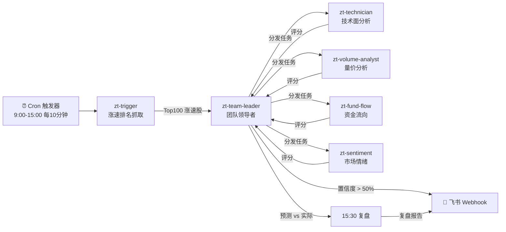

# 涨停预测 Agent Room (Maneki)

基于 Agent Room 架构的 A 股涨停预测智能体团队。

## 核心理念

```text
定时扫描 -> 专家会诊 -> 加权投票 -> 信号推送 -> 收盘复盘
```

不靠单一模型预测，而是让多个领域专家 agent 独立评估，再通过加权聚合得出置信度，最大程度降低误判。

## 系统架构



## Agent 团队

| Agent | 职责 | 分析维度 | 默认权重 |
|---|---|---|---|
| zt-trigger | 定时触发，拉取涨速Top100 | - | - |
| zt-technician | K线形态、均线、MACD/KDJ/RSI | 技术面 | 25% |
| zt-volume-analyst | 成交量异动、换手率、封板量 | 量价面 | 25% |
| zt-fund-flow | 主力净流入、大单占比、北向资金 | 资金面 | 25% |
| zt-sentiment | 涨停基因、连板效应、板块共振 | 情绪面 | 25% |
| zt-team-leader | 聚合、加权、信号输出、复盘 | 综合 | - |

## 工作流

### 盘中扫描 (9:00-15:00)

```text
1. zt-trigger 每10分钟调用涨速排名API
2. 获取当前涨速前100股票，构建任务列表
3. 下发给 zt-team-leader
4. team-leader 并行分发给4个子agent
5. 每个子agent独立评估，返回0-100涨停概率评分
6. team-leader 加权聚合，计算综合置信度
7. 置信度 > 50% 的股票纳入涨停信号表
8. 信号表通过飞书webhook推送给用户
```

### 收盘复盘 (15:30)

```text
1. team-leader 对比当日所有预测 vs 实际涨跌结果
2. 计算每个子agent的鉴别力 (命中评分均值 - 未命中评分均值)
3. 根据准确率调整各agent权重建议
4. 生成复盘报告发送飞书
```

## 置信度计算

```text
综合置信度 = Σ (子agent评分 × 子agent权重) / Σ (子agent权重)

未返回结果的agent权重归零，不参与计算。
```

### 置信度等级

| 等级 | 范围 | 含义 |
|---|---|---|
| 高 | 80-100 | 多维度共振，涨停概率极高 |
| 中高 | 65-79 | 主维度看多，辅助维度部分确认 |
| 中等 | 50-64 | 某些维度看多但整体偏弱 |
| 低 | 0-49 | 不纳入信号表 |

## 目录结构

```text
maneki-agent/
  README.md
  agents/
    zt-trigger/        # 定时触发器定义
    zt-technician/     # 技术面分析师
    zt-volume-analyst/ # 量价分析师
    zt-fund-flow/      # 资金流向分析师
    zt-sentiment/      # 市场情绪分析师
    zt-team-leader/    # 团队领导者
  docs/
    architecture.md    # 架构设计
    flow.md            # 工作流详解
    scoring.md         # 评分体系
    review.md          # 复盘机制
    risk.md            # 风险提示
  shared/
    api-keys-sop.md    # API密钥管理
    feishu-setup.md    # 飞书webhook配置
    data-sources.md    # 数据源说明
  templates/
    agent/             # agent定义模板
    docker/            # Docker Compose模板
    task-bus/          # 任务总线配置
    feishu/            # 飞书通知模板
  skills/
    zt-surge-fetcher/      # 涨速数据抓取
    zt-technical-analysis/ # 技术面分析
    zt-volume-analysis/    # 量价分析
    zt-fund-flow-analysis/ # 资金流向分析
    zt-sentiment-analysis/ # 市场情绪分析
    zt-signal-aggregator/  # 信号聚合
    zt-review-engine/      # 复盘引擎
    zt-feishu-notifier/    # 飞书通知
```

## 快速开始

### 1. 配置环境变量

```bash
cp .env.example .env
# 编辑 .env 填入 API 密钥和飞书 Webhook URL
```

### 2. 启动 Agent 团队

```bash
cd /root/agent-room
docker compose up -d
```

### 3. 验证运行

```bash
# 检查所有agent状态
docker compose ps

# 查看team-leader日志
docker logs zt-team-leader --tail 50

# 手动触发一次扫描
curl -X POST http://127.0.0.1:8642/trigger
```

## 风险提示

- 本系统仅供研究参考，不构成任何投资建议
- 涨停预测准确率受市场环境影响，历史表现不代表未来
- 权重调整建议需人工确认后方可生效
- 不得将本系统用于实际交易决策

## License

MIT. See `LICENSE`.